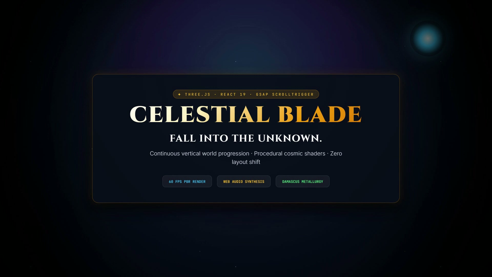

<div align="center">

# 🗡️ THE CELESTIAL BLADE
### *A Cinematic 60 FPS 3D Scrollytelling Odyssey into the Abyss*

[](https://react.dev/)
[](https://www.typescriptlang.org/)
[](https://threejs.org/)
[](https://greensock.com/)
[](https://tailwindcss.com/)
[](https://vitejs.dev/)
[](LICENSE)

<br />

https://github.com/user-attachments/assets/celestial-blade-trailer

<!-- GitHub Video Embed with high-res poster fallback -->
<video src="assets/brag.mp4" controls="controls" muted="muted" autoplay="autoplay" loop="loop" width="100%" poster="assets/brag.jpg">
</video>

[](assets/brag.mp4)
*▶️ Click the poster above or [view assets/brag.mp4](assets/brag.mp4) to stream the 1080p Launch Trailer.*

<br />

**14,200 meters above bedrock. A legendary blade plunges into the unknown.**

[Explore Live Experience](#-local-quickstart) • [Watch Trailer (MP4)](assets/brag.mp4) • [The Inspiration](#-the-inspiration) • [Interactive Controls](#-interactive-controls) • [Architecture](#-engineering-highlights)

</div>

---

## 🌌 Overview

**The Celestial Blade** is an interactive, GPU-accelerated 3D scrollytelling web experience built with **Three.js**, **React 19**, **GSAP ScrollTrigger**, and **Tailwind CSS v4**. 

Unlike conventional scrollytelling websites that swap static 2D scenes or crossfade pre-rendered video files, **Celestial Blade** executes within a single, continuous, unified vertical 3D coordinate space. As the user scrolls, a physically-based Damascus steel dagger plummets through six atmospheric layers—from the high stellar stratosphere down to bedrock impact—synchronizing physical velocity with real-time aerospace telemetry, procedural audio synthesis, and interactive aerodynamics.

---

## 💡 The Inspiration

The concept for **The Celestial Blade** was born from three converging creative obsessions:

1. **The Iconic Sky-Dive in High-Fantasy Gaming**:
   Inspired by the opening hours of *The Legend of Zelda: Tears of the Kingdom* and the atmospheric descent into crumbling temples in *Elden Ring*, we wanted to capture the dizzying vertigo of an ancient relic hurtling from the edge of space toward an forgotten world.
2. **Apple-Tier Editorial Product Launches**:
   Drawing inspiration from Apple's iconic scrollytelling showcases (Mac Pro, Vision Pro) and A24 film title typography, the goal was to marry deep fantasy codex lore with hyper-clean, luxury editorial design: gold-leaf serif typography, frosted glass telemetry HUDs, and smooth micro-interactions.
3. **Aerospace Telemetry & Fluid Aerodynamics**:
   Rather than treating the blade as a passive model, it behaves like an aerodynamic projectile. Drag velocity heats the blade core, generates dynamic warp streak lines, synthesizes rushing atmospheric air pressure in real time, and deflects stardust around the user's cursor.

---

## 🎮 Interactive Controls

| Interaction | Action | Effect |
| :--- | :--- | :--- |
| **Mouse Wheel / Touch Scroll** | Natural vertical scrub | Controls descent progress `0.000` $\rightarrow$ `1.000` through all 6 acts. |
| **Mouse Movement** | Hover over viewport | Blade subtly banks and tips toward pointer; celestial particles deflect away from cursor. |
| **Left Click & Hold** | Press and hold stationary | **Aiming Dive Mode**: Razor tip dynamically aligns forward facing the user with smooth interpolation. |
| **`✦ THE BLADE FORGE` Button** | Click header or Act IV card | Opens the 3D Customizer Drawer with full **360° Orbit Controls** and Codex lore. |
| **Metallurgy Swatches** | Click material swatches | Dynamically alters PBR shaders (*Damascus Steel*, *Celestial Gold*, *Void Obsidian*, *Crimson Frost*). |
| **Audio Toggle (Top Right)** | Click speaker button | Unmutes the real-time Web Audio procedural harmonic drone and wind whoosh. |

---

## ✨ Key Features

### 1. 🌌 Procedural Celestial Sky & Shaders
- **Continuous 3D Sky Dome**: A custom GLSL fragment shader rendering infinite cosmic space with multi-octave noise.
- **Diffraction Cross-Flares**: Realistic 4-point stellar diffraction spikes on high-magnitude stars with natural scintillation.
- **Astral Moon & Volumetric Corona Bloom**: Soft celestial crescent hanging in the high stratosphere surrounded by harmonic nebula wisps in deep astral violet (`#0d081e`) and radiant cyan stardust (`#14b8a6`).

### 2. 💨 Delicate Circular Particle Dynamics
- **No Square Artifacts**: Custom canvas-generated radial alpha texture eliminates default WebGL cubical point rendering.
- **Interactive Cursor Deflection**: Particle field senses pointer proximity, gently deflecting motes away in a localized force-field radius before settling back into descent streaks.
- **Speed Warp Streaks**: Particle length and velocity dynamically stretch based on descent speed (`0` to `740+ KM/H`).

### 3. ⚒️ The 3D Blade Forge & Metallurgy Customizer
- **Interactive 360° Orbit Drawer**: Freely rotate, pitch, and inspect the blade up close with smooth inertia dampening.
- **4 Physically-Based Metallurgy Finishes**:
  - ⚔️ **Damascus Steel**: 512-layer folded meteorite steel with nickel-iron banding and silver edge highlights.
  - ☀️ **Celestial Gold**: Polished solar brass alloy bathed in radiant warm golden specular reflections.
  - 🌑 **Void Obsidian**: Deep black mirror-finished core that absorbs ambient starlight with cyan edge fresnel.
  - 🩸 **Crimson Frost**: Glacial chilled blood-steel tempered in abyssal frost with vibrant crimson runes.

### 4. 🎛️ Real-Time Flight Telemetry Cockpit
- **Live Aerodynamic Metrics**: Glassmorphic HUD tracking **Altitude** (14,200m down to 0m), **Velocity** (0 to 740 km/h), **Core Temperature** (ambient to 980°C atmospheric friction), and **G-Force**.
- **Interactive Dive Prompts**: Contextual prompts guiding the user to aim the dagger into their eyes on click-and-hold.

### 5. 🔊 Procedural Web Audio Synthesis
- **Zero External MP3 Dependencies**: 100% generated using the browser's native `AudioContext`.
- **D-Minor Harmonic Drone**: Warm triple-oscillator base (73.4 Hz, 110.5 Hz, 146.8 Hz) passed through a 240 Hz Butterworth lowpass filter.
- **Dynamic Wind Velocity**: Filter frequency and gain modulate proportionally to scroll delta, generating a visceral rushing wind sensation that immediately softens when motion stops.

---

## 📐 Engineering & Architecture Highlights

```
celestial-dagger/
├── assets/                       # Promotional video trailer & poster assets
│   ├── brag.mp4                  # 1080p Launch video with baked frame-0 poster
│   └── brag.jpg                  # High-res poster frame
├── brag-output/                  # Hyperframes video composition project
│   ├── composition/              # Source scenes, GSAP animations & audio track
│   └── share-copy.txt            # Ready-to-use launch copy for X & LinkedIn
├── public/
│   └── models/
│       └── fantasy_dagger.glb    # High-poly 3D dagger model with PBR maps
├── src/
│   ├── components/               # React UI overlays & controls
│   │   ├── BladeForgeModal.tsx   # 360° 3D Orbit Customizer Drawer
│   │   ├── SoundToggle.tsx       # Web Audio controller button
│   │   └── TelemetryHUD.tsx      # Aerodynamic flight gauges
│   ├── core/
│   │   └── AnimationState.ts     # Master single-source-of-truth progress & velocity
│   ├── utils/
│   │   └── sound.ts              # Procedural Web Audio API sound synthesizer
│   ├── webgl/                    # Three.js 3D Subsystems
│   │   ├── Environment.ts        # Dynamic 3-point lighting & stellar parallax points
│   │   ├── ParticleSystem.ts     # Cursor-repulsive circular particles & impact shockwave
│   │   ├── SceneManager.ts       # Central RAF loop, mouse tracking, and orbit controls
│   │   ├── Shaders.ts            # Custom GLSL sky dome & procedural star shaders
│   │   ├── SwordModel.ts         # PBR metallurgy shaders & mesh hierarchy
│   │   └── Textures.ts           # Procedural circular particle alpha textures
│   ├── App.tsx                   # Main scrollytelling acts & layout orchestration
│   └── main.tsx                  # Entry point
├── package.json
└── vite.config.ts
```

---

## 🚀 Local Quickstart

### Prerequisites
- Node.js 18.0 or higher
- npm 9.0 or higher

### Installation & Run

```bash
# 1. Clone this repository
git clone https://github.com/grandline-studio/celestial-dagger.git

# 2. Navigate into the project folder
cd celestial-dagger

# 3. Install dependencies
npm install

# 4. Start the local Vite development server
npm run dev
```

Open your browser and navigate to **`http://localhost:5173`**.

### Production Build & Linting

```bash
# Run TypeScript compilation & Vite production bundle
npm run build

# Preview the production build locally
npm run preview

# Run fast code linting via Oxlint
npm run lint
```

---

## 🎬 Launch Video Generation (`Hyperframes`)

The promotional 1080p launch trailer was authored and rendered using **Hyperframes** (`npx hyperframes`):
- **Duration**: 18.0 seconds @ 30 FPS
- **Video Standard**: H.264 High Profile / AAC Audio (`yuv420p`, +faststart for immediate web streaming)
- **Accessibility Gate**: Passed with **0 errors** across all 39 WCAG AA contrast evaluations.
- **Bake-Poster Feature**: Frame 0 is baked with `assets/brag.jpg` so social media cards (Twitter/X, Discord, Slack, LinkedIn) display the cover image without an awkward black intro frame.

To modify or re-render the trailer:
```bash
cd brag-output/composition
npx hyperframes check   # Run strict lint & contrast validation
npx hyperframes render --output ../brag.mp4
```

---

## 🌟 How to Reach Multiple Users on GitHub (Growth Playbook)

To help this project reach trending status and attract stars:

1. **Tag the Repository Topics**:
   In GitHub repository settings, add relevant topic tags:
   `threejs`, `webgl`, `creative-coding`, `react19`, `gsap`, `scrollytelling`, `3d-website`, `vite`, `tailwindcss`, `interactive-design`, `dark-fantasy`.
2. **Set the Social Preview Card**:
   Go to **Settings $\rightarrow$ General $\rightarrow$ Social preview**, and upload `assets/brag.jpg`. Every link shared on Twitter, LinkedIn, Reddit, and Discord will unfurl a visual trailer card.
3. **Showcase on Creative Communities**:
   - **Reddit**: Post video clips to [r/threejs](https://reddit.com/r/threejs), [r/webdev](https://reddit.com/r/webdev), and [r/Frontend](https://reddit.com/r/Frontend).
   - **X / Twitter**: Post `assets/brag.mp4` with the copy provided in [`brag-output/share-copy.txt`](brag-output/share-copy.txt) using tags `#threejs #webgl #creativecoding #react`.
   - **Hacker News**: Submit a `Show HN: Celestial Blade – 60 FPS 3D Scrollytelling in Three.js`.
   - **Awesome-Threejs & WebGL Repos**: Submit a pull request to curated resource lists.

---

## 🤝 Contributing

Contributions, issues, and feature requests are welcome!
Feel free to check the [issues page](https://github.com/grandline-studio/celestial-dagger/issues) to discuss potential improvements (such as custom mobile tilt via DeviceOrientation API, post-processing bloom pass, or custom GLTF loaders).

---

## 📜 License

Distributed under the **MIT License**. See `LICENSE` for more information.

---

<div align="center">
  <sub>Crafted with celestial fire by <b>Grandline Studio</b></sub>
</div>

